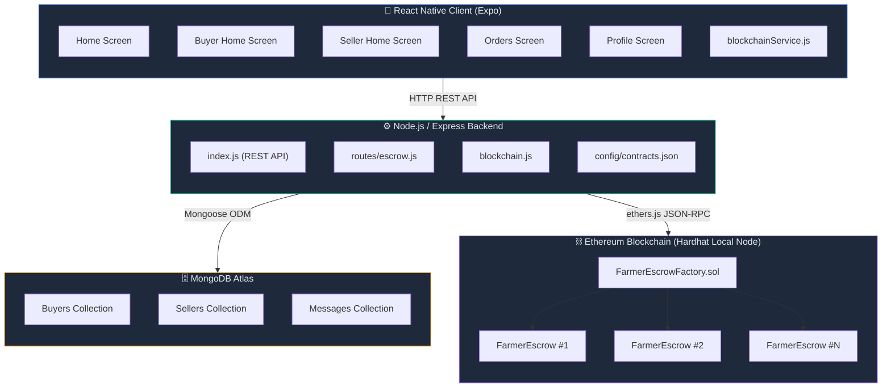
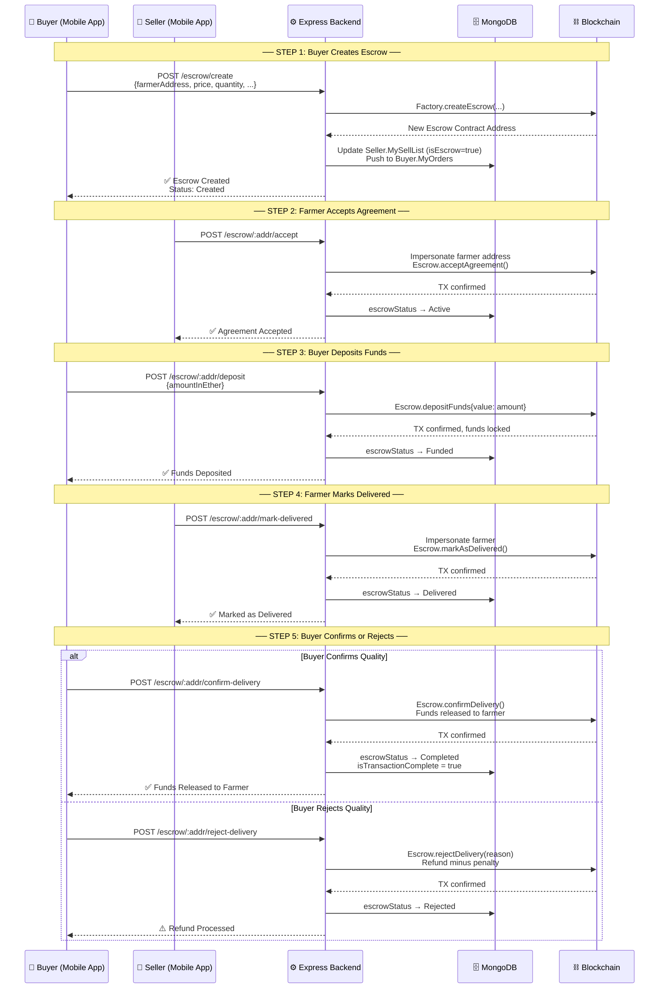
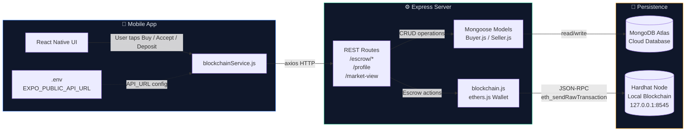
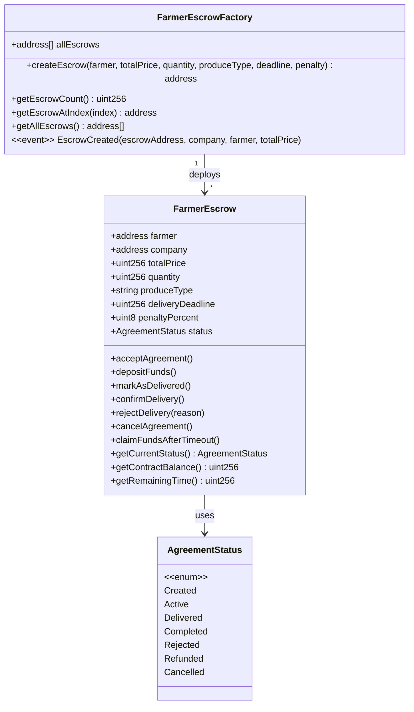
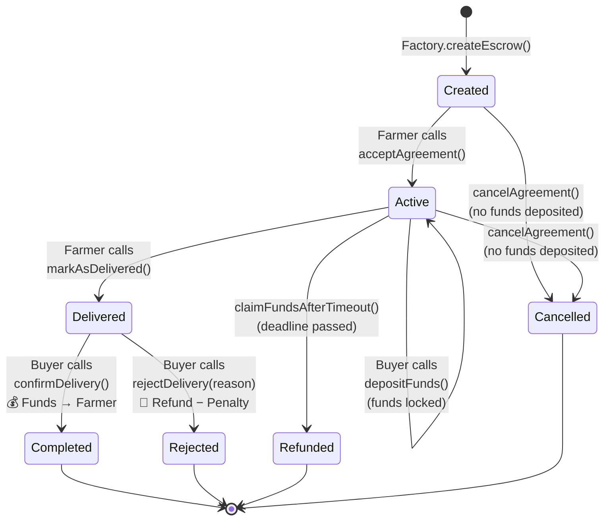

# Farm2Market — System Architecture & Flow

## High-Level Architecture

---

## Escrow Transaction Lifecycle Flow

---

## Data Flow Between Layers

---

## Smart Contract Hierarchy

---

## Escrow State Machine

