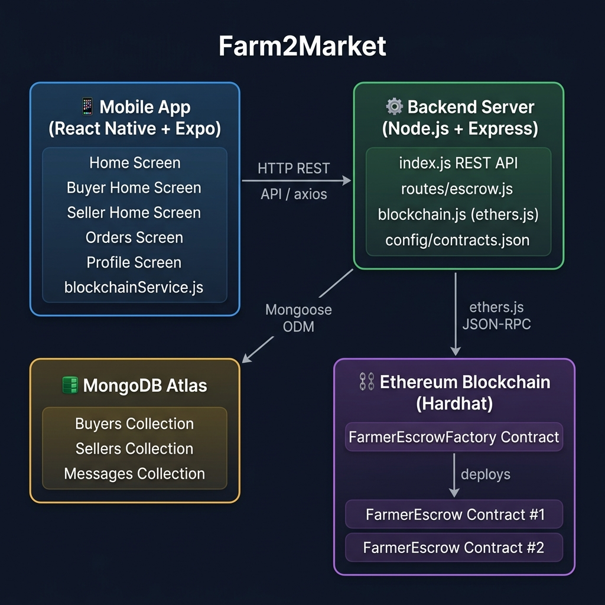
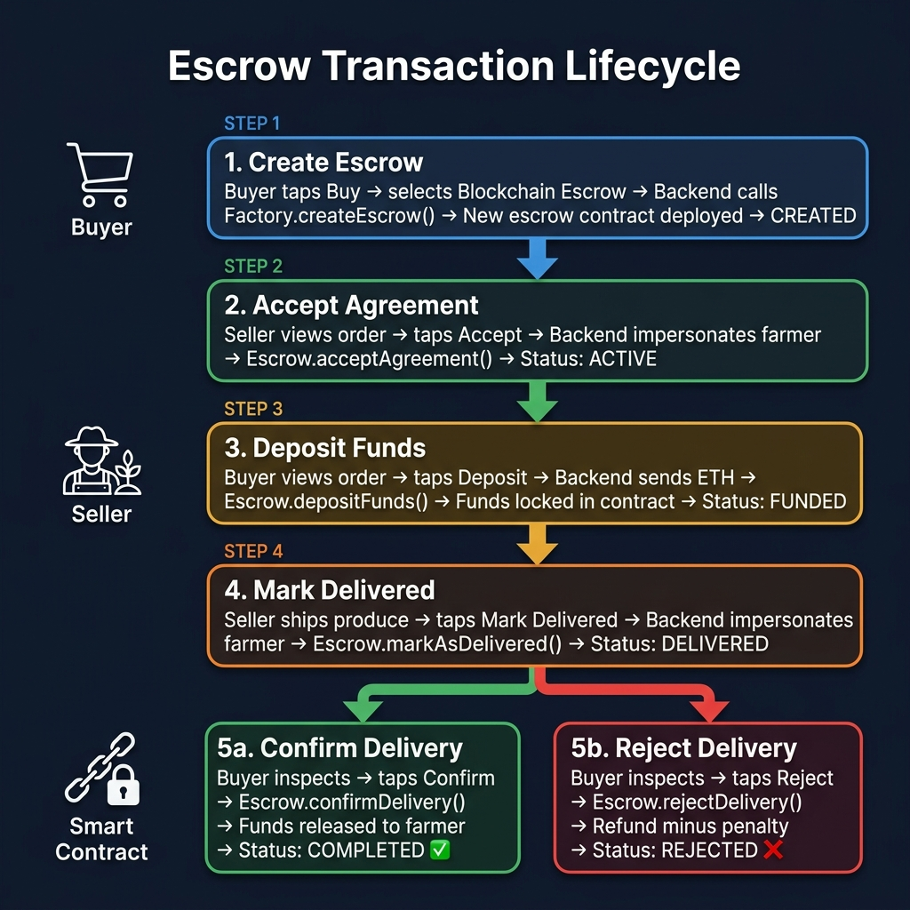
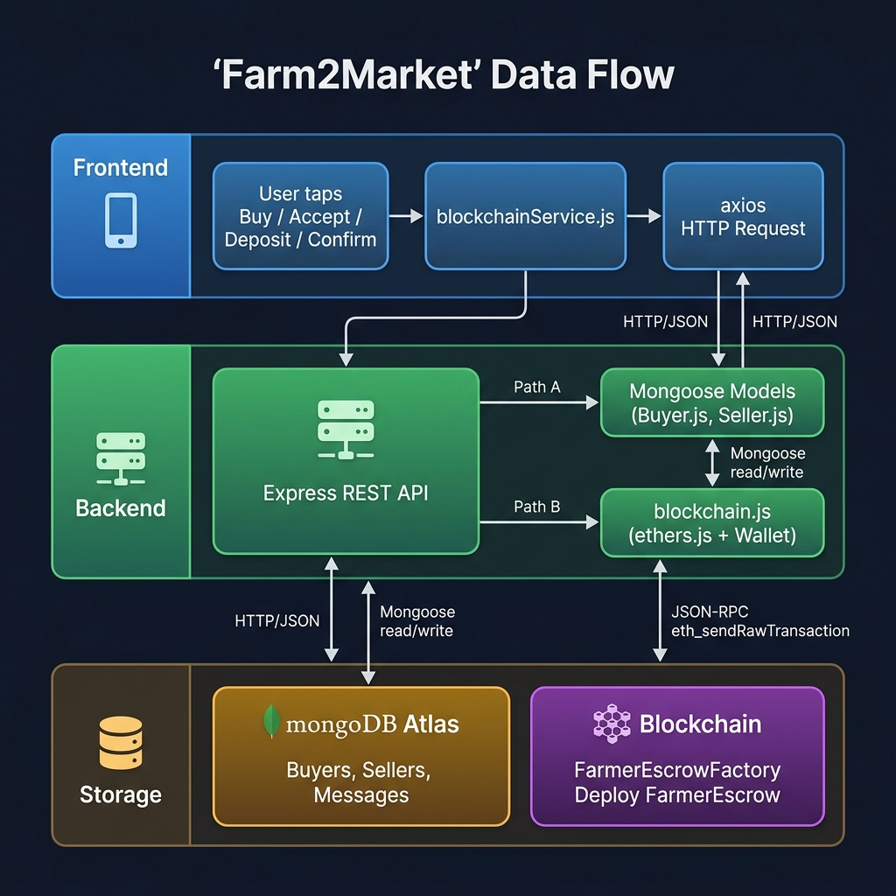
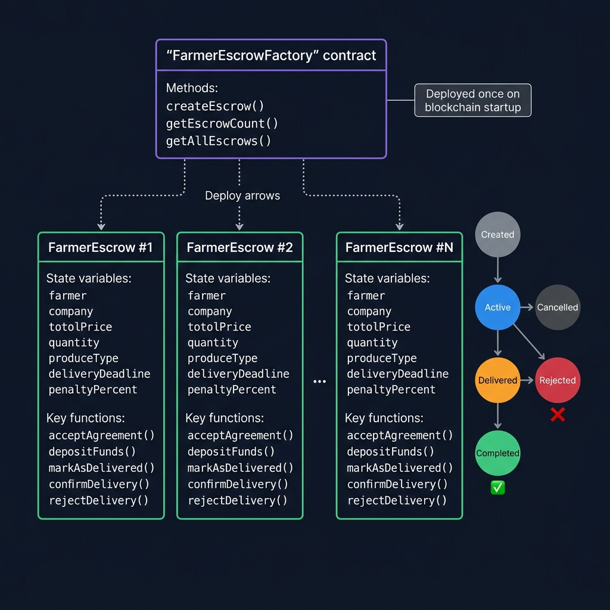

# Farm2Market — System Architecture & Flow

---

## 1. High-Level System Architecture

This diagram shows the four main layers of the Farm2Market system and how they communicate:



| Layer | Technology | Purpose |
|-------|-----------|---------|
| **📱 Mobile App** | React Native + Expo | User interface for Buyers and Sellers |
| **⚙️ Backend Server** | Node.js + Express | REST API, business logic, blockchain bridge |
| **🗄️ Database** | MongoDB Atlas | Persistent storage for users, orders, messages |
| **⛓️ Blockchain** | Hardhat + Solidity | Smart contract escrow for secure trade settlement |

---

## 2. Escrow Transaction Lifecycle

This flowchart shows the complete lifecycle of an escrow transaction, from creation to completion:



### Quick Reference

| Step | Who | Action | Contract Call | Result |
|------|-----|--------|---------------|--------|
| 1 | Buyer | Create escrow | `Factory.createEscrow()` | New contract deployed |
| 2 | Seller | Accept agreement | `Escrow.acceptAgreement()` | Status → Active |
| 3 | Buyer | Deposit funds | `Escrow.depositFunds()` | ETH locked in contract |
| 4 | Seller | Mark delivered | `Escrow.markAsDelivered()` | Status → Delivered |
| 5a | Buyer | Confirm delivery | `Escrow.confirmDelivery()` | 💰 Funds → Farmer |
| 5b | Buyer | Reject delivery | `Escrow.rejectDelivery()` | 💸 Refund − Penalty |

---

## 3. Data Flow Between Layers

This diagram shows how data moves through the system from a user tap to the database and blockchain:



### Communication Protocols

| From | To | Protocol | Library |
|------|----|----------|---------|
| Mobile App | Backend | HTTP REST / JSON | `axios` |
| Backend | MongoDB | TCP (MongoDB Wire) | `mongoose` |
| Backend | Blockchain | JSON-RPC over HTTP | `ethers.js v6` |

---

## 4. Smart Contract Structure & State Machine

This diagram shows the Solidity contract hierarchy and the escrow state transitions:



### Contract Details

**FarmerEscrowFactory** *(deployed once)*
- `createEscrow()` — Deploys a new `FarmerEscrow` child contract
- `getAllEscrows()` — Returns all deployed escrow addresses
- `getEscrowCount()` — Returns total number of escrows

**FarmerEscrow** *(one per trade)*
- **State Variables**: `farmer`, `company`, `totalPrice`, `quantity`, `produceType`, `deliveryDeadline`, `penaltyPercent`
- **Farmer Actions**: `acceptAgreement()`, `markAsDelivered()`
- **Buyer Actions**: `depositFunds()`, `confirmDelivery()`, `rejectDelivery()`
- **Safety**: `cancelAgreement()`, `claimFundsAfterTimeout()`

### State Transitions

```
                                    cancelAgreement()
                              ┌──────────────────────────┐
                              │                          ▼
  ┌─────────┐  accept   ┌─────────┐  deposit   ┌─────────┐  markDelivered  ┌───────────┐
  │ CREATED │──────────▶│  ACTIVE │───────────▶│  FUNDED │───────────────▶│ DELIVERED │
  └─────────┘           └─────────┘            └─────────┘               └───────────┘
                              │                                            │         │
                              │ timeout                          confirm   │         │ reject
                              ▼                                   ▼        │         ▼
                        ┌──────────┐                        ┌───────────┐  │   ┌──────────┐
                        │ REFUNDED │                        │ COMPLETED │  │   │ REJECTED │
                        └──────────┘                        └───────────┘  │   └──────────┘
                                                               ✅ Funds    │      ❌ Refund
                                                              → Farmer     │     − Penalty
                                                                           │
                                                                    timeout│
                                                                           ▼
                                                                    ┌───────────┐
                                                                    │ COMPLETED │
                                                                    │ (auto)    │
                                                                    └───────────┘
```

---

## 5. File Structure Overview

```
F2M/
├── client/                          # 📱 React Native (Expo) App
│   ├── .env                         #    → EXPO_PUBLIC_API_URL config
│   ├── App.js                       #    → Navigation & role selection
│   ├── components/
│   │   ├── BuyerHomeScreen.js       #    → Market browsing + escrow creation
│   │   ├── SellerHomeScreen.js      #    → Crop listing
│   │   ├── OrdersScreen.js          #    → Escrow pipeline tracker
│   │   └── ProfileScreen.js         #    → Wallet address linking
│   └── services/
│       └── blockchainService.js     #    → HTTP client for escrow API
│
├── server/                          # ⚙️ Node.js + Express Backend
│   ├── index.js                     #    → Main server, REST routes
│   ├── blockchain.js                #    → ethers.js wallet + contract ops
│   ├── fund_system.js               #    → Wallet funding utility
│   ├── routes/
│   │   └── escrow.js                #    → /escrow/* API endpoints
│   ├── modals/
│   │   ├── Buyer.js                 #    → Mongoose Buyer schema
│   │   └── Seller.js                #    → Mongoose Seller schema
│   └── config/
│       └── contracts.json           #    → Factory address + ABIs
│
├── fyp-sc-smartcontract/            # ⛓️ Hardhat + Solidity
│   ├── contracts/
│   │   ├── FarmerEscrow.sol         #    → Individual escrow contract
│   │   └── FarmerEscrowFactory.sol  #    → Factory deployer
│   └── scripts/
│       └── deploy.js                #    → Deployment script
│
├── ARCHITECTURE.md                  # ← You are here
├── ESCROW_GUIDE.md                  # Step-by-step escrow testing guide
└── START_SERVERS.md                 # Server startup commands
```
